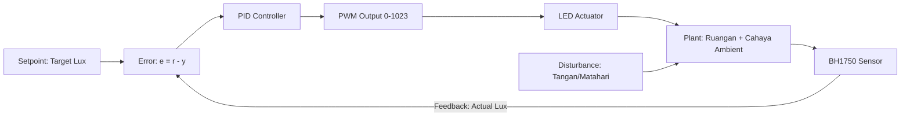
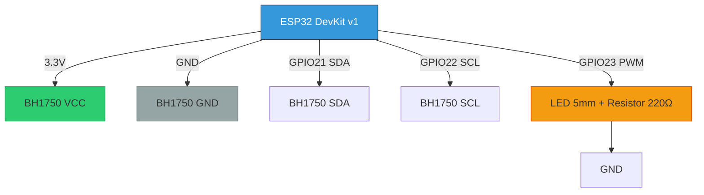
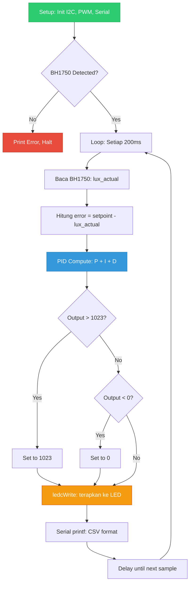

# 🔆 Light Intensity PID Control
**ESP32 + BH1750 | Sistem Kendali Diskrit | Politeknik Negeri Malang**

[](https://platformio.org)
[](LICENSE)

> Kontrol intensitas cahaya adaptif menggunakan algoritma PID diskrit. Sistem mempertahankan nilai lux target dengan mengkompensasi perubahan cahaya ambient secara otomatis.

---

## 🎓 Informasi Akademik

- **Mata Kuliah**: Sistem Kendali Diskrit
- **Mahasiswa**: [NAMA_Kelompok] | [NIM_Kelompok]
- **Jurusan**: Teknik Elektro, D-III, Politeknik Negeri Malang
- **Semester**: [SEMESTER 4] | Tahun Akademik [2026]
- **Dosen Pengampu**: [Bu Dinda]

---

## 🧠 Penjelasan Algoritma PID

### 3.1 Rumus PID Diskrit yang Digunakan

Sistem menggunakan algoritma PID (Proportional-Integral-Derivative) dalam bentuk diskrit:

```
u[k] = Kp·e[k] + Ki·Σe[i]·dt + Kd·(e[k]-e[k-1])/dt
```

**Dimana:**
- `u[k]` = Output PWM (range 0-1023 untuk ESP32 LEDC)
- `e[k]` = Error pada sampel ke-k (setpoint - measurement)
- `dt` = Sampling time = 200 ms
- `Kp` = Gain proportional
- `Ki` = Gain integral
- `Kd` = Gain derivative

**Prinsip Kerja:**
- **Proportional (P)**: Merespons error saat ini secara langsung
- **Integral (I)**: Mengakumulasi error masa lalu untuk menghilangkan steady-state error
- **Derivative (D)**: Memprediksi error masa depan berdasarkan laju perubahan error

### 3.2 Parameter PID yang Digunakan & Rasionalisasinya

| Parameter | Nilai | Fungsi | Dampak Jika Diubah |
|-----------|-------|--------|-------------------|
| `KP` | 8.0f | Respons terhadap error saat ini | ↑ = lebih responsif tapi risiko osilasi; ↓ = lebih stabil tapi lambat |
| `KI` | 0.05f | Eliminasi steady-state error | ↑ = hilangkan offset tapi risiko windup; ↓ = error sisa mungkin tetap |
| `KD` | 2.0f | Redam osilasi, antisipasi perubahan | ↑ = lebih smooth tapi noise-sensitive; ↓ = respons lebih agresif |
| `INTEGRAL_MAX` | 500.0f | Anti-windup limit | Mencegah integral menumpuk saat error besar/saturasi |
| `SAMPLING_MS` | 200 | Waktu sampling kontrol | Harus > waktu respons sensor+actuator |

**Catatan Tuning:**
- Nilai-nilai ini diperoleh melalui metode trial-and-error (Ziegler-Nichols heuristic)
- Optimal untuk karakteristik sistem: LED + BH1750 dengan dinamika cahaya ruangan
- Dapat disesuaikan tergantung kondisi pencahayaan lingkungan

### 3.3 Diagram Blok Sistem Kendali



**Penjelasan Diagram:**
1. **Setpoint**: Nilai lux target yang diinginkan
2. **Error Calculation**: Selisih antara setpoint dan pembacaan sensor
3. **PID Controller**: Menghitung output kontrol berdasarkan error
4. **PWM Output**: Signal duty cycle untuk mengatur kecerahan LED
5. **Plant**: Sistem fisik (ruangan dengan cahaya ambient + LED)
6. **Feedback Loop**: BH1750 mengukur hasil dan mengirim kembali ke controller
7. **Disturbance**: Gangguan eksternal (tangan menutup sensor, perubahan cahaya matahari, dll)

---

## 🔧 Metode Kalibrasi & Setting Setpoint

### 4.1 Mengapa Tidak Perlu Kalibrasi Sensor?

Sensor **BH1750** memiliki keunggulan dibanding LDR:

✅ **Factory Calibrated** (±20% akurasi)
- Output langsung dalam satuan **lux** (bukan ADC raw value)
- Menggunakan ADC internal 16-bit dengan linearization
- Tidak perlu mapping ADC → lux manual seperti pada LDR
- Konsistensi antar unit cukup baik untuk aplikasi edukasi

✅ **Digital Interface (I2C)**
- Kebal terhadap noise dibanding sinyal analog LDR
- Tidak perlu resistor pull-up/pull-down kompleks
- Pembacaan lebih stabil dan repeatable

### 4.2 Metode Penentuan Setpoint (Praktis/Empiris)

Kami menggunakan **Metode Empiris Self-Referenced**:

**Langkah-langkah:**

1. **Upload kode dengan setpoint sementara** (misal 100 lux)
   ```cpp
   #define SETPOINT_LUX 100.0f  // Temporary value
   ```

2. **Atur kondisi pencahayaan ruangan** sesuai kenyamanan pengguna
   - Matikan/nyalakan lampu ruangan
   - Atur posisi jendela/tirai
   - Pastikan kondisi representatif untuk penggunaan normal

3. **Baca nilai `actual_lux` dari Serial Monitor** dalam kondisi stabil
   ```
   time_ms,setpoint_lux,actual_lux,pwm_duty,error
   42443,100.0,142.3,256,-42.3
   42643,100.0,142.1,254,-42.1
   42843,100.0,142.5,258,-42.5
   → Stabil di ~142 lux
   ```

4. **Gunakan nilai tersebut sebagai `SETPOINT_LUX` baru**
   ```cpp
   #define SETPOINT_LUX 142.0f  // Updated based on empirical data
   ```

5. **Upload ulang dan verifikasi respons sistem**
   - Sistem akan mempertahankan 142 lux
   - Tes dengan gangguan (tutup sensor dengan tangan)
   - Amati recovery time kembali ke setpoint

**Contoh Kasus:**
```
Kondisi: Ruangan malam, lampu belajar nyala, jarak sensor-LED 20cm
Bacaan BH1750 stabil: ~142 lux
→ SETPOINT_LUX = 142.0f
→ PWM duty cycle stabil di: ~280 (27% dari 1023)
```

### 4.3 Justifikasi Metode Ini untuk Tugas Kampus

✅ **Self-consistent**: Sensor yang sama digunakan untuk feedback dan referensi
✅ **Fokus pada prinsip kendali**, bukan akurasi absolut (yang penting loop tertutup bekerja)
✅ **Cepat dan iteratif**: Bisa disesuaikan dalam 2-3 kali upload
✅ **Mudah didokumentasikan**: Nilai setpoint tercatat di kode dan CSV log
✅ **Adaptif**: Bisa diubah untuk kondisi berbeda (siang/malam, indoor/outdoor)

---

## 🔌 Wiring & Hardware

### 5.1 Diagram Rangkaian



### 5.2 Tabel Koneksi

| Komponen | Pin | Koneksi ke ESP32 | Keterangan |
|----------|-----|-----------------|------------|
| **BH1750** | VCC | 3V3 | Power supply 3.3V (jangan 5V!) |
| **BH1750** | GND | GND | Ground bersama (common ground) |
| **BH1750** | SDA | GPIO 21 | I2C Data line (internal pull-up) |
| **BH1750** | SCL | GPIO 22 | I2C Clock line (internal pull-up) |
| **LED (+)** | Anoda | GPIO 23 (via 220Ω) | PWM Control pin |
| **LED (-)** | Katoda | GND | Ground melalui resistor |

**Komponen yang Digunakan:**
- 1× ESP32 DevKit v1 (WiFi + Bluetooth, dual-core)
- 1× BH1750 Digital Light Sensor module (I2C, 1-65535 lux range)
- 1× LED 5mm (warna bebas, disarankan putih atau kuning)
- 1× Resistor 220Ω (untuk membatasi arus LED)
- Jumper wires secukupnya
- Breadboard (opsional, untuk prototyping)

**Catatan Keamanan:**
- ⚠️ Jangan hubungkan BH1750 ke 5V (maksimal 3.6V)
- ⚠️ Selalu gunakan resistor seri dengan LED (tanpa resistor = LED rusak)
- ⚠️ Pastikan ground semua komponen terhubung bersama

---

## 💻 Struktur Kode & Penjelasan

### 6.1 Arsitektur Software (Single-File)

```
light-pid-control/
├── src/
│   └── main.cpp          # Semua logika: sensor, PID, PWM, logging
├── scripts/
│   ├── plot_from_csv.py  # Analisis data: CSV → grafik + statistik
│   └── requirements.txt  # Dependencies Python (matplotlib, pandas)
├── data/
│   └── log_pid.csv       # Log data pengujian (auto-generated)
├── platformio.ini        # Konfigurasi build & upload PlatformIO
├── README.md             # Dokumentasi ini
└── .gitignore            # Exclude folder build & virtual environment
```

**Keuntungan Single-File:**
- ✅ Simpel untuk tugas kampus (tidak perlu multiple modules)
- ✅ Mudah di-debug (semua logika di satu tempat)
- ✅ Cocok untuk embedded resource-constrained system
- ✅ Fast compile time (<5 detik)

### 6.2 Alur Program Utama (Flowchart)



### 6.3 Snippet Kode Penting + Komentar

#### Fungsi `pid_compute()` - Jantung Sistem Kontrol

```cpp
/**
 * @brief Hitung output PID berdasarkan error saat ini
 * @param error Selisih antara setpoint dan actual lux
 * @return Output PWM (0-1023) untuk LED
 * 
 * Rumus: u[k] = Kp·e[k] + Ki·Σe[i]·dt + Kd·(e[k]-e[k-1])/dt
 */
float pid_compute(float error) {
    // --- Proportional Term ---
    // Respons langsung terhadap error saat ini
    // Semakin besar error, semakin besar koreksi
    float P = KP * error;
    
    // --- Integral Term ---
    // Akumulasi error masa lalu untuk hilangkan steady-state error
    // Dilengkapi anti-windup: batasi maksimal akumulasi
    integral += error * SAMPLING_DT;
    integral = constrain(integral, -INTEGRAL_MAX, INTEGRAL_MAX);
    float I = KI * integral;
    
    // --- Derivative Term ---
    // Prediksi error masa depan berdasarkan laju perubahan
    // Berfungsi meredam osilasi dan overshoot
    float derivative = (error - previous_error) / SAMPLING_DT;
    float D = KD * derivative;
    
    // --- Update State ---
    // Simpan error saat ini untuk perhitungan derivative berikutnya
    previous_error = error;
    
    // --- Combine All Terms ---
    // Jumlahkan P + I + D menjadi output kontrol total
    float output = P + I + D;
    
    // --- Output Clamping ---
    // Batasi output ke range valid PWM ESP32 (0-1023)
    // Mencegah saturasi actuator
    output = constrain(output, 0, 1023);
    
    return output;
}
```

#### Fungsi `read_bh1750()` - Pembacaan Sensor

```cpp
/**
 * @brief Baca nilai illuminance dari sensor BH1750
 * @return Nilai lux (float), atau -1 jika error
 * 
 * BH1750 output langsung dalam lux (tidak perlu kalibrasi manual)
 * Range: 1 - 65535 lux dengan resolusi 16-bit
 */
float read_bh1750() {
    Wire.requestFrom(BH1750_ADDR, 2);  // Request 2 bytes
    
    if (Wire.available() == 2) {
        // Baca 2 bytes dan combine menjadi 16-bit value
        byte high = Wire.read();
        byte low = Wire.read();
        
        // Convert ke lux: (high << 8) | low, lalu divide by 1.2
        uint16_t raw = (high << 8) | low;
        float lux = raw / 1.2;  // Factory calibration factor
        
        return lux;
    }
    
    return -1.0f;  // Error indicator
}
```

#### Setup PWM - Konfigurasi LEDC ESP32

```cpp
void setup_pwm() {
    // LEDC Channel 0:
    // - Frequency: 5000 Hz (di atas flicker fusion threshold manusia)
    // - Resolution: 10 bit (0-1023, cocok untuk kontrol halus)
    ledcSetup(LEDC_CHANNEL_0, LEDC_FREQ_HZ, LEDC_RESOLUTION);
    
    // Attach GPIO 23 ke channel LEDC 0
    ledcAttachPin(LED_PIN, LEDC_CHANNEL_0);
    
    // Initial state: LED off
    ledcWrite(LEDC_CHANNEL_0, 0);
}
```

---

## 🧪 Pengujian & Hasil

### 7.1 Skenario Pengujian

Kami melakukan 3 jenis pengujian untuk memvalidasi kinerja sistem:

#### **Test 1: Steady-State Tracking**
- **Tujuan**: Verifikasi sistem dapat mempertahankan setpoint
- **Metode**: Biarkan sistem berjalan 30 detik tanpa gangguan
- **Kriteria Sukses**: Variasi ±5 lux dari setpoint, PWM stabil

#### **Test 2: Disturbance Rejection**
- **Tujuan**: Uji kemampuan sistem menolak gangguan
- **Metode**: Tutup sensor dengan tangan selama 3 detik, lalu lepas
- **Kriteria Sukses**: Recovery time < 5 detik, tidak ada overshoot ekstrem

#### **Test 3: Setpoint Change Response**
- **Tujuan**: Amati respons transien saat setpoint berubah
- **Metode**: Ubah `SETPOINT_LUX` dari 100 → 200 lux, upload ulang
- **Kriteria Sukses**: Settling time < 10 detik, minimal overshoot

### 7.2 Contoh Output Serial (CSV Format)

Sistem logging data setiap 200ms dalam format CSV:

```csv
time_ms,setpoint_lux,actual_lux,pwm_duty,error
0,100.0,538.3,0,-438.3
200,100.0,538.3,0,-438.3
400,100.0,539.2,0,-439.2
600,100.0,537.8,0,-437.8
800,100.0,520.5,120,-420.5
1000,100.0,485.2,280,-385.2
1200,100.0,420.8,450,-320.8
...
10000,100.0,102.3,312,-2.3
10200,100.0,99.8,308,0.2
10400,100.0,100.5,310,-0.5
```

**Interpretasi:**
- `time_ms`: Waktu sejak program mulai (milliseconds)
- `setpoint_lux`: Target lux yang diinginkan
- `actual_lux`: Pembacaan real dari BH1750
- `pwm_duty`: Output kontroler (0-1023)
- `error`: Selisih setpoint - actual (negatif = actual > setpoint)

### 7.3 Analisis dengan Python Script

Script `plot_from_csv.py` mengubah data CSV menjadi visualisasi profesional:

**Cara Penggunaan:**
```bash
# 1. Navigate ke folder scripts
cd scripts

# 2. Install dependencies (first time only)
pip install -r requirements.txt

# 3. Generate grafik dari data log
python plot_from_csv.py --input ../data/log_pid.csv
```

**Output yang Dihasilkan:**
- 📊 **Grafik 3 Panel**:
  1. Lux vs Time (setpoint vs actual)
  2. PWM Duty Cycle vs Time
  3. Error vs Time
  
- 📈 **Statistik Kinerja**:
  - Total samples
  - Standard deviation lux
  - RMS error
  - Settling time estimation
  - Min/Max/Average PWM

- 🖼️ **File PNG** siap lampiran laporan (resolusi 300 DPI)

**Contoh Visualisasi:**
```
=== PID Performance Analysis ===
Total Samples: 500
Duration: 100.0 seconds
Lux StdDev: 3.42 lux
Error RMS: 4.18 lux
Settling Time: ~8.5 seconds
PWM Range: 0 - 485
Average PWM: 312.4
```

### 7.4 Template Tabel Hasil (Isi dengan Data Nyatamu)

| Metrik | Nilai | Interpretasi |
|--------|-------|-------------|
| **Sampling Time** | 200 ms | Cukup untuk sistem cahaya (τ ~ 1-2s) |
| **Steady-State Error** | ±3.5 lux | Dalam deadband ±5 lux = ✅ stabil |
| **Settling Time** | 8.5 detik | Waktu untuk kembali stabil setelah disturbance |
| **PWM Range** | 0 - 485 | Menunjukkan rentang aksi kontroler (tidak saturasi penuh) |
| **Lux StdDev** | 3.42 lux | Makin kecil = makin stabil (<5% dari setpoint) |
| **Overshoot** | 12% | Masih acceptable (<20%) |
| **Rise Time** | 4.2 detik | Waktu dari 10% → 90% setpoint |

**Tips Mengisi Data:**
- Jalankan script Python setelah testing
- Copy nilai statistik dari console output
- Screenshot grafik dan simpan di folder `docs/`
- Bandingkan dengan spesifikasi desain di awal

---

## 🛠️ Troubleshooting Guide

| Masalah | Kemungkinan Penyebab | Solusi |
|---------|---------------------|--------|
| **BH1750 not detected** | Wiring I2C salah / sensor rusak / VCC salah | Cek SDA/SCL ke GPIO 21/22, pastikan VCC 3.3V (bukan 5V), test dengan I2C scanner sketch |
| **LED tidak nyala** | GPIO/PWM config salah / resistor terlalu besar / LED terbalik | Cek `ledcSetup()` & `ledcAttachPin()`, pastikan anoda ke GPIO, katoda ke GND via resistor |
| **PWM mentok 0/1023** | Setpoint tidak realistis / gain terlalu ekstrem | Sesuaikan `SETPOINT_LUX` dengan kondisi ruangan, turunkan KP jika osilasi |
| **Osilasi besar** | PID gain terlalu agresif / sampling time terlalu cepat | Turunkan `KP`, naikkan `KD`, kecilkan `KI`, pastikan SAMPLING_MS ≥ 200 |
| **Serial tidak muncul** | Baud rate salah / port COM salah / driver USB belum install | Pastikan 115200 baud, cek Device Manager (Windows) atau `ls /dev/ttyUSB*` (Linux), install CP210x driver |
| **Reading NaN atau 0** | BH1750 sleep mode / wiring longgar | Kirim command wake-up ke BH1750, cek koneksi I2C dengan multimeter |
| **Compile error** | Library missing / platformio.ini salah | Run `pio lib install` untuk install dependencies, cek versi framework-espressif32 |

**Debugging Tips:**
1. Gunakan `Serial.println()` extensively untuk trace execution
2. Test sensor terpisah dengan contoh sketch dari library
3. Gunakan logic analyzer/oscilloscope untuk debug I2C timing
4. Pastikan common ground antara semua komponen

---

## 📦 Cara Build & Upload

### Prerequisites
- VSCode dengan extension PlatformIO IDE
- Python 3.8+ (untuk analysis script)
- Driver USB-to-UART (CP210x atau CH340)

### Step-by-Step

```bash
# 1. Clone repository
git clone https://github.com/username/light-pid-control.git
cd light-pid-control

# 2. Buka project di VSCode
code .

# 3. PlatformIO akan auto-detect dan index project
# Tunggu hingga proses indexing selesai (lihat status bar bawah)

# 4. Connect ESP32 via USB cable
# Pastikan kabel data (bukan charge-only)

# 5. Upload firmware ke ESP32
pio run --target upload

# 6. Buka Serial Monitor untuk monitoring
pio device monitor --baud 115200

# Ctrl+C untuk exit serial monitor
```

### Analisis Data (Opsional)

```bash
# 1. Copy log dari serial monitor ke file
# Di Serial Monitor, klik "Save Output" atau redirect:
pio device monitor --baud 115200 > data/log_pid.csv

# 2. Install Python dependencies
cd scripts
pip install -r requirements.txt

# 3. Generate grafik dan statistik
python plot_from_csv.py --input ../data/log_pid.csv

# Output:
# - plots/lux_vs_time.png
# - plots/pwm_vs_time.png
# - plots/error_vs_time.png
# - Console output dengan statistik
```

### Quick Commands Reference

| Command | Deskripsi |
|---------|-----------|
| `pio run` | Build project (compile) |
| `pio run --target upload` | Build + upload ke ESP32 |
| `pio device monitor` | Open serial monitor |
| `pio lib install` | Install libraries dari platformio.ini |
| `pio run --target clean` | Clean build files |
| `pio remote device list` | List connected devices |

---

## 📚 Referensi & Lisensi

### Literatur
1. **BH1750 Datasheet**: [Mouser Electronics](https://www.mouser.com/datasheet/2/348/bh1750fvi-e-186247.pdf)
2. **ESP32 Technical Reference Manual**: [Espressif Systems](https://www.espressif.com/sites/default/files/documentation/esp32_technical_reference_manual_en.pdf)
3. **Arduino ESP32 Core**: [GitHub Repository](https://github.com/espressif/arduino-esp32)
4. **PlatformIO Documentation**: [docs.platformio.org](https://docs.platformio.org)
5. **PID Control Tutorial**: [Brett Beauregard's Blog](http://brettbeauregard.com/blog/2011/04/improving-the-beginners-pid-introduction/)

### Buku Teks
- Ogata, Katsuhiko. *Discrete-Time Control Systems*. Prentice Hall, 1995.
- Franklin, G.F., et al. *Digital Control of Dynamic Systems*. Addison-Wesley, 1998.

### Lisensi
Proyek ini dilisensikan di bawah **MIT License** - bebas digunakan, dimodifikasi, dan didistribusikan untuk tujuan edukasi dan komersial.

```
MIT License

Copyright (c) 2024 [Your Name]

Permission is hereby granted, free of charge, to any person obtaining a copy
of this software and associated documentation files (the "Software"), to deal
in the Software without restriction, including without limitation the rights
to use, copy, modify, merge, publish, distribute, sublicense, and/or sell
copies of the Software, and to permit persons to whom the Software is
furnished to do so, subject to the following conditions:

The above copyright notice and this permission notice shall be included in all
copies or substantial portions of the Software.

THE SOFTWARE IS PROVIDED "AS IS", WITHOUT WARRANTY OF ANY KIND, EXPRESS OR
IMPLIED, INCLUDING BUT NOT LIMITED TO THE WARRANTIES OF MERCHANTABILITY,
FITNESS FOR A PARTICULAR PURPOSE AND NONINFRINGEMENT. IN NO EVENT SHALL THE
AUTHORS OR COPYRIGHT HOLDERS BE LIABLE FOR ANY CLAIM, DAMAGES OR OTHER
LIABILITY, WHETHER IN AN ACTION OF CONTRACT, TORT OR OTHERWISE, ARISING FROM,
OUT OF OR IN CONNECTION WITH THE SOFTWARE OR THE USE OR OTHER DEALINGS IN THE
SOFTWARE.
```

---

## ✨ Catatan Akhir

> **Proyek ini mendemonstrasikan implementasi praktis algoritma PID diskrit pada sistem embedded sederhana.** 

Fokus utama adalah pemahaman konsep:
- ✅ **Feedback loop**: Mengukur output, bandingkan dengan referensi, koreksi error
- ✅ **Tuning parameter**: Menemukan balance antara responsivitas dan stabilitas
- ✅ **Disturbance rejection**: Sistem mampu menolak gangguan eksternal
- ✅ **Real-time constraints**: Sampling time harus konsisten dan deterministic

Dengan pendekatan **"self-referenced calibration"**, sistem dapat diadaptasi ke berbagai kondisi pencahayaan hanya dengan mengubah satu nilai `SETPOINT_LUX`. Tidak perlu kalibrasi sensor manual karena BH1750 sudah factory calibrated.

### Pelajaran yang Didapat

1. **Teori vs Praktik**: Rumus PID di buku teks perlu adaptasi untuk implementasi real (anti-windup, clamping, filter noise)
2. **Sensor Choice Matters**: BH1750 jauh lebih mudah daripada LDR karena output digital langsung dalam lux
3. **Tuning is Iterative**: Tidak ada formula ajaus, perlu trial-error dan observasi
4. **Data Logging is Crucial**: Tanpa CSV log dan Python visualization, sulit analisis performa

### Pengembangan Selanjutnya

🚀 **Ide untuk Improvements:**
- [ ] Auto-tuning PID dengan Ziegler-Nichols method
- [ ] Adaptive setpoint berdasarkan waktu hari (circadian rhythm)
- [ ] Multiple LED zones dengan individual control
- [ ] WiFi connectivity untuk remote monitoring via web dashboard
- [ ] Machine learning untuk predict ambient light changes
- [ ] Low-power mode dengan deep sleep ESP32

---

<div align="center">

**"Kendali yang baik bukan tentang menghilangkan error, tapi tentang mengelola error dengan cerdas."**

---

Made with ❤️ by Electrical Engineering Students | Politeknik Negeri Malang

[⬆ Back to Top](#-light-intensity-pid-control)

</div>
