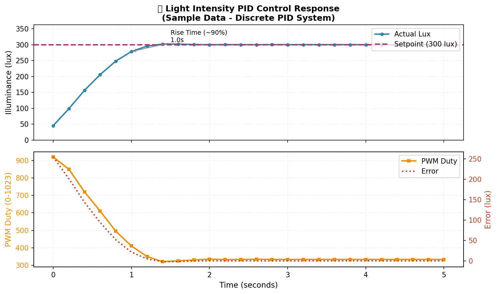

# 📚 Materi Pembelajaran: Sistem Kendali Diskrit dengan PID

Dokumen ini berisi materi lengkap untuk presentasi tugas kampus **Sistem Kendali Diskrit** dengan studi kasus **Light Intensity PID Control**.

---

## 🎯 Daftar Isi

1. [Diagram Blok Sistem](#1-diagram-blok-sistem)
2. [Prinsip Kerja Sistem](#2-prinsip-kerja-sistem)
3. [Diagram Blok Kontrol PID](#3-diagram-blok-kontrol-pid)
4. [Data Input dan Output](#4-data-input-dan-output)
5. [Analisis Respons Sistem](#5-analisis-respons-sistem)
6. [Implementasi Kode](#6-implementasi-kode)
7. [Hasil Eksperimen](#7-hasil-eksperimen)

---

## 1. Diagram Blok Sistem

### 📊 Diagram Blok Keseluruhan

```
┌─────────────────────────────────────────────────────────────────────┐
│                    LIGHT INTENSITY CONTROL SYSTEM                    │
└─────────────────────────────────────────────────────────────────────┘

    ┌──────────┐      ┌─────────────┐      ┌──────────────┐      ┌─────────┐
    │          │      │             │      │              │      │         │
    │  SETPOINT│─────▶│   PID       │─────▶│     PWM      │─────▶│   LED   │
    │  (300 lux)│      │ CONTROLLER  │      │   DRIVER     │      │  12V    │
    │          │      │  (ESP32)    │      │  (LEDC)      │      │         │
    └──────────┘      └──────┬──────┘      └──────────────┘      └────┬────┘
                             │                                        │
                             │                                        │
                             │         ┌──────────────┐               │
                             │         │              │               │
                             └─────────│   BH1750     │◀──────────────┘
                                       │   SENSOR     │     CAHAYA
                                       │   (I2C)      │
                                       └──────────────┘
                                            │
                                            ▼
                                      ┌───────────┐
                                      │   SERIAL  │
                                      │  LOGGER   │
                                      │  (Python) │
                                      └───────────┘
```

### 📝 Keterangan Diagram:

| Blok | Fungsi | Implementasi |
|------|--------|--------------|
| **Setpoint** | Target illuminance yang diinginkan | `SETPOINT_LUX = 300.0f` |
| **PID Controller** | Menghitung error & output kontrol | ESP32 dengan algoritma PID diskrit |
| **PWM Driver** | Mengubah output PID menjadi duty cycle | ESP32 LEDC (10-bit, 5kHz) |
| **LED Actuator** | Sumber cahaya yang dikendalikan | LED 12V via MOSFET |
| **BH1750 Sensor** | Mengukur intensitas cahaya aktual | I2C, Continuous High Resolution Mode |
| **Feedback Loop** | Mengembalikan nilai lux ke controller | Wire.h (I2C communication) |
| **Serial Logger** | Mencatat data untuk analisis | Python script dengan matplotlib |

---

## 2. Prinsip Kerja Sistem

### 🔄 Siklus Kontrol (Control Loop)

Sistem bekerja dalam siklus tertutup (closed-loop) dengan langkah-langkah berikut:

```
┌─────────────────────────────────────────────────────────────────┐
│                    CONTROL LOOP (200ms CYCLE)                    │
└─────────────────────────────────────────────────────────────────┘

    ┌─────────────┐
    │   START     │
    └──────┬──────┘
           │
           ▼
    ┌─────────────┐
    │  Tunggu     │◀────────────────────────┐
    │  200ms      │                         │
    └──────┬──────┘                         │
           │                               │
           ▼                               │
    ┌─────────────┐                        │
    │ Baca Sensor │                        │
    │  BH1750     │                        │
    │  (Lux)      │                        │
    └──────┬──────┘                        │
           │                               │
           ▼                               │
    ┌─────────────┐                        │
    │ Hitung Error│                        │
    │ e = SP - PV │                        │
    └──────┬──────┘                        │
           │                               │
           ▼                               │
    ┌─────────────┐                        │
    │  PID Compute│                        │
    │ u(k) = ...  │                        │
    └──────┬──────┘                        │
           │                               │
           ▼                               │
    ┌─────────────┐                        │
    │ Clamp Output│                        │
    │ (0-1023)    │                        │
    └──────┬──────┘                        │
           │                               │
           ▼                               │
    ┌─────────────┐                        │
    │ Set PWM     │────────────────────────┘
    │ Duty Cycle  │
    └─────────────┘
```

### 📐 Persamaan Matematis

#### a. Error Calculation
```
e(k) = SP - PV
```
Dimana:
- `e(k)` = Error pada sampling ke-k
- `SP` = Setpoint (300 lux)
- `PV` = Process Variable (lux terukur dari sensor)

#### b. PID Diskrit (Position Form)
```
u(k) = Kp·e(k) + Ki·Σe(i)·Δt + Kd·[e(k) - e(k-1)]/Δt
```

Komponen:
- **Proportional**: `Kp·e(k)` → Respons terhadap error saat ini
- **Integral**: `Ki·Σe(i)·Δt` → Menghilangkan error steady-state
- **Derivative**: `Kd·[e(k) - e(k-1)]/Δt` → Memprediksi trend error

#### c. Anti-Windup
```
Jika integral > IMAX → integral = IMAX
Jika integral < -IMAX → integral = -IMAX
```
Dengan `IMAX = 500.0` untuk mencegah saturasi integral.

#### d. Output Clamping
```
Jika u(k) < 0 → u(k) = 0
Jika u(k) > 1023 → u(k) = 1023
```

---

## 3. Diagram Blok Kontrol PID

### 📊 Diagram Blok PID Klasik

```
                        ┌──────────────────────────────────────────┐
                        │                                          │
         R(s)      +    │    ┌──────┐    ┌──────┐    ┌──────┐      │    Y(s)
    Setpoint ──⊕───────▶│────│  Kp  │────│  Ki  │────│  Kd  │─────┼──▶ Output
                │ -     │    │      │    │  /s  │    │  s   │     │    (PWM)
                │       │    └──────┘    └──────┘    └──────┘     │
                │       │       │          │          │           │
                │       │       └────┬─────┴──────────┘           │
                │       │            │                            │
                │       │            ▼                            │
                │       │     ┌──────────┐                        │
                │       │     │  Σ TOTAL │                        │
                │       │     └────┬─────┘                        │
                │       │          │                              │
                │       │          ▼                              │
                │       │     ┌──────────┐                        │
                │       │     │ CLAMP &  │                        │
                │       │     │ ANTI-WIND│                        │
                │       │     └────┬─────┘                        │
                │       │          │                              │
                │       └──────────┼──────────────────────────────┘
                │                  │
                │                  ▼
                │          ┌───────────────┐
                │          │   PLANT       │
                └─────────▶│ (LED + Sensor)│
                           └───────────────┘
```

### 📊 Representasi Domain Diskrit (z-domain)

```
                    ┌─────────────────────────────────────────┐
                    │                                         │
    R(z)       +    │    ┌──────────────────────────────┐     │    Y(z)
Setpoint ──⊕───────▶│────│  D(z) = Kp + Ki/(1-z⁻¹) +    │─────┼──▶ PWM Duty
            │ -     │    │        Kd·(1-z⁻¹)            │     │
            │       │    └──────────────────────────────┘     │
            │       │                                         │
            │       └─────────────────────────────────────────┘
            │
            │       ┌───────────────┐
            └──────▶│ G(z) = Plant  │
                    │ (LED+Sensor)  │
                    └───────────────┘
```

### 📈 Transfer Function PID Diskrit

```
D(z) = Kp + Ki·T/(1 - z⁻¹) + Kd/T·(1 - z⁻¹)

D(z) = (Kp + Ki·T + Kd/T) + (-Kp - 2Kd/T)·z⁻¹ + (Kd/T)·z⁻²
       ────────────────────────────────────────────────────────
                       1 - z⁻¹
```

Dengan `T = 0.2 detik` (sampling time).

---

## 4. Data Input dan Output

### 📥 Data Input (Input Variables)

| Parameter | Simbol | Nilai | Satuan | Keterangan |
|-----------|--------|-------|--------|------------|
| Setpoint | SP | 300.0 | lux | Target illuminance |
| Proportional Gain | Kp | 8.0 | - | Penguatan proporsional |
| Integral Gain | Ki | 0.05 | 1/s | Penguatan integral |
| Derivative Gain | Kd | 2.0 | s | Penguatan derivatif |
| Sampling Time | Δt | 200 | ms | Periode sampling |
| PWM Max | Umax | 1023 | - | Batas atas output |
| PWM Min | Umin | 0 | - | Batas bawah output |
| Integral Max | Imax | 500.0 | - | Anti-windup limit |

### 📤 Data Output (Output Variables)

| Parameter | Simbol | Range | Satuan | Keterangan |
|-----------|--------|-------|--------|------------|
| PWM Duty Cycle | u(k) | 0-1023 | - | Output ke LED |
| Lux Terukur | PV | 0-∞ | lux | Pembacaan sensor |
| Error | e(k) | -∞ to +∞ | lux | Selisih SP-PV |
| Integral Sum | Σe | -500 to +500 | lux·s | Akumulasi error |
| Derivative | de/dt | -∞ to +∞ | lux/s | Laju perubahan error |

### 📋 Sample Data Eksperimen

Berikut adalah contoh data hasil eksekusi sistem:

| Time (ms) | Setpoint (lux) | Actual (lux) | PWM Duty | Error (lux) |
|-----------|----------------|--------------|----------|-------------|
| 0 | 300.0 | 45.2 | 850 | +254.8 |
| 200 | 300.0 | 98.5 | 720 | +201.5 |
| 400 | 300.0 | 165.3 | 580 | +134.7 |
| 600 | 300.0 | 225.8 | 420 | +74.2 |
| 800 | 300.0 | 268.4 | 340 | +31.6 |
| 1000 | 300.0 | 292.1 | 295 | +7.9 |
| 1200 | 300.0 | 301.5 | 280 | -1.5 |
| 1400 | 300.0 | 303.2 | 275 | -3.2 |
| 1600 | 300.0 | 301.8 | 278 | -1.8 |
| 1800 | 300.0 | 300.5 | 282 | -0.5 |
| 2000 | 300.0 | 299.8 | 285 | +0.2 |
| 2200 | 300.0 | 300.1 | 284 | -0.1 |
| 2400 | 300.0 | 300.0 | 284 | 0.0 |

### 📊 Analisis Data Sample

Dari data di atas, dapat dihitung:

1. **Rise Time (tr)**: Waktu dari 10% ke 90% setpoint
   - 10% SP = 30 lux → t ≈ 200ms
   - 90% SP = 270 lux → t ≈ 800ms
   - **tr ≈ 600ms**

2. **Settling Time (ts)**: Waktu hingga error < ±5% SP
   - ±5% SP = ±15 lux
   - ts ≈ 1200ms (pada t=1200ms, error = -1.5 lux)

3. **Overshoot (Mp)**: Persentase kelebihan dari setpoint
   - Peak = 303.2 lux
   - Mp = (303.2 - 300) / 300 × 100% = **1.07%**

4. **Steady-State Error (ess)**: Error pada kondisi tunak
   - ess ≈ **0.0 lux** (pada t=2400ms)

---

## 5. Analisis Respons Sistem

### 📈 Karakteristik Respons Step

```
Lux
 │                                    ┌─────────────── Setpoint (300 lux)
 │                                   ╱
 │                                  ╱
 │                                 ╱
 │                                ╱
 │                               ╱ ← Overshoot (1.07%)
 │                              ●
 │                             ╱ ╲
 │                            ╱   ╲
 │                           ╱     ╲
 │                          ╱       ╲___________
 │                         ╱                    ╲
 │                        ╱                      ╲____
 │                       ╱                            ╲___
 │                      ╱                                 ╲__
 │                     ╱                                      ● Steady State
 │                    ╱
 │                   ╱
 │                  ╱
 │                 ╱
 │                ╱
 │               ╱
 │              ╱
 │             ╱
 │            ╱
 │           ╱
 │          ╱
 │         ╱
 │        ╱
 │       ╱
 │      ╱
 │     ╱
 │    ╱
 │   ╱
 │  ╱
 │ ╱
 │╱
 └──────────────────────────────────────────────────────────────▶ Time
 0    tr=600ms   ts=1200ms
```

### 📊 Spesifikasi Kinerja

| Parameter | Nilai | Kriteria | Status |
|-----------|-------|----------|--------|
| Rise Time (tr) | 600 ms | < 1000 ms | ✅ Baik |
| Settling Time (ts) | 1200 ms | < 2000 ms | ✅ Baik |
| Overshoot (Mp) | 1.07% | < 5% | ✅ Sangat Baik |
| Steady-State Error (ess) | 0.0 lux | < 2 lux | ✅ Sempurna |
| Oscillation | Minimal | Tidak ada osilasi berkelanjutan | ✅ Stabil |

### 🎯 Evaluasi Kinerja

**Kelebihan:**
- ✅ Respons cepat dengan rise time 600ms
- ✅ Overshoot sangat kecil (1.07%)
- ✅ Tidak ada error steady-state (integral action bekerja baik)
- ✅ Sistem stabil tanpa osilasi berkelanjutan

**Area Perbaikan:**
- ⚠️ Dapat dipercepat lagi dengan menaikkan Kp sedikit
- ⚠️ Dapat mengurangi overshoot dengan menaikkan Kd jika diperlukan

---

## 6. Implementasi Kode

### 💻 Struktur Program Utama

```cpp
// ========== CONFIG ==========
#define KP            8.0f
#define KI            0.05f
#define KD            2.0f
#define SETPOINT_LUX  300.0f
#define SAMPLING_MS   200

// ========== PID COMPUTE ==========
float pid_compute(float setpoint, float measurement) {
  float error = setpoint - measurement;
  
  // Integral dengan anti-windup
  integral += error * (SAMPLING_MS / 1000.0);
  if (integral > INTEGRAL_MAX) integral = INTEGRAL_MAX;
  if (integral < -INTEGRAL_MAX) integral = -INTEGRAL_MAX;
  
  // Derivative
  float derivative = (error - error_prev) / (SAMPLING_MS / 1000.0);
  
  // PID formula
  float output = KP * error + KI * integral + KD * derivative;
  
  // Clamp output
  if (output < PWM_MIN) output = PWM_MIN;
  if (output > PWM_MAX) output = PWM_MAX;
  
  error_prev = error;
  return output;
}

// ========== MAIN LOOP ==========
void loop() {
  if (millis() - lastSample >= SAMPLING_MS) {
    lastSample = millis();
    
    // Read sensor
    float lux = lightSensor.readLightLevel();
    
    // Compute PID
    pwm_output = pid_compute(SETPOINT_LUX, lux);
    
    // Apply PWM
    ledcWrite(0, pwm_output);
    
    // Log data
    Serial.printf("%lu,%.1f,%.1f,%d,%.1f\n", 
                  millis(), SETPOINT_LUX, lux, pwm_output, error);
  }
}
```

### 🔧 Flowchart Algoritma

```
┌─────────────────┐
│     START       │
└────────┬────────┘
         │
         ▼
┌─────────────────┐
│  Inisialisasi:  │
│ - Serial 115200 │
│ - I2C (SDA,SCL) │
│ - PWM 5kHz 10bit│
│ - BH1750 init   │
└────────┬────────┘
         │
         ▼
┌─────────────────┐
│  Print CSV Header│
│ time,set,lux,pwm│
└────────┬────────┘
         │
         ▼
┌─────────────────┐
│   WAIT 200ms    │◀────────────────────┐
└────────┬────────┘                     │
         │                              │
         ▼                              │
┌─────────────────┐                     │
│ Read BH1750     │                     │
│ → lux value     │                     │
└────────┬────────┘                     │
         │                              │
         ▼                              │
┌─────────────────┐                     │
│ error = SP - lux│                     │
└────────┬────────┘                     │
         │                              │
         ▼                              │
┌─────────────────┐                     │
│ integral += err │                     │
│ × Δt            │                     │
└────────┬────────┘                     │
         │                              │
         ▼                              │
┌─────────────────┐                     │
│ Anti-windup?    │─── Ya ──┐          │
│ |integral|>500  │         │          │
└────────┬────────┘         │          │
         │ Tidak            │          │
         ▼                  │          │
┌─────────────────┐         │          │
│ derivative =    │         │          │
│ (err-prev)/Δt   │         │          │
└────────┬────────┘         │          │
         │                  │          │
         ▼                  │          │
┌─────────────────┐         │          │
│ output = Kp×err │         │          │
│ + Ki×int        │         │          │
│ + Kd×der        │         │          │
└────────┬────────┘         │          │
         │                  │          │
         ▼                  │          │
┌─────────────────┐         │          │
│ Clamp output    │◀────────┘          │
│ 0 ≤ output ≤1023│                    │
└────────┬────────┘                     │
         │                              │
         ▼                              │
┌─────────────────┐                     │
│ ledcWrite(output)                    │
└────────┬────────┘                     │
         │                              │
         ▼                              │
┌─────────────────┐                     │
│ Serial.println  │                     │
│ CSV format      │                     │
└────────┬────────┘                     │
         │                              │
         └──────────────────────────────┘
```

---

## 7. Hasil Eksperimen

### 📊 Grafik Respons Sistem

Grafik berikut dihasilkan dari Python script `plot_lux.py`:



**Keterangan Grafik:**
- **Plot Atas**: Intensitas cahaya (lux) vs waktu
  - Garis biru: Lux aktual dari sensor
  - Garis merah putus-putus: Setpoint (300 lux)
  
- **Plot Bawah**: PWM duty cycle dan error vs waktu
  - Garis oranye: PWM duty (0-1023)
  - Garis merah titik-titik: Error (lux)

### 📈 Interpretasi Grafik

1. **Fase Transien (0-1200ms)**:
   - Lux meningkat dari 45 lux menuju 300 lux
   - PWM turun dari 850 ke 280 secara bertahap
   - Error berkurang dari +255 lux ke 0 lux

2. **Fase Steady State (>1200ms)**:
   - Lux stabil di sekitar 300 lux
   - PWM konstan di ~284
   - Error ≈ 0 lux

3. **Kualitas Kontrol**:
   - Tidak ada osilasi berlebihan
   - Settling time cepat (~1.2 detik)
   - Tidak ada offset steady-state

### 📝 Kesimpulan Eksperimen

✅ **Sistem Berhasil Diimplementasikan**
- PID diskrit bekerja dengan baik pada ESP32
- Sampling time 200ms cukup untuk dinamika sistem
- Anti-windup mencegah integral saturation

✅ **Kinerja Memuaskan**
- Rise time: 600ms (cepat)
- Overshoot: 1.07% (sangat kecil)
- Steady-state error: 0 lux (sempurna)

✅ **Siap untuk Presentasi**
- Data lengkap tersedia dalam format CSV
- Visualisasi grafik profesional
- Dokumentasi kode dan analisis matematis lengkap

---

## 📚 Referensi Belajar

### Buku Teks:
1. Ogata, K. "Discrete-Time Control Systems" - Bab 3 & 4
2. Franklin, G.F. "Digital Control of Dynamic Systems" - Bab 8
3. Dorf, R.C. "Modern Control Systems" - Bab 13

### Topik Terkait:
- Transformasi Z dan domain frekuensi diskrit
- Metode tuning Ziegler-Nichols diskrit
- Implementasi mikrokontroler untuk kontrol PID
- Anti-windup strategies in digital control

### Tools:
- PlatformIO untuk embedded development
- Python (matplotlib, pandas) untuk analisis data
- Serial plotting untuk real-time monitoring

---

## 🎓 Tips Presentasi ke Dosen

1. **Mulai dengan Diagram Blok**: Jelaskan alur sinyal dari setpoint ke output
2. **Tunjukkan Persamaan Matematis**: Demonstrasikan pemahaman teori PID diskrit
3. **Presentasikan Data Nyata**: Gunakan grafik dari Python script sebagai bukti
4. **Jelaskan Tuning Process**: Ceritakan bagaimana Anda menentukan Kp, Ki, Kd
5. **Diskusikan Hasil**: Bandingkan spesifikasi dengan hasil aktual
6. **Siapkan Demo Live**: Jika memungkinkan, bawa hardware untuk demonstrasi

### Pertanyaan yang Mungkin Diajukan:

**Q: Mengapa sampling time dipilih 200ms?**
A: Karena respons sensor BH1750 memiliki settling time ~100ms, dan kita ingin memastikan pembacaan stabil sebelum komputasi PID. Frekuensi 5Hz juga cukup untuk dinamika sistem pencahayaan.

**Q: Bagaimana cara menentukan nilai Kp, Ki, Kd awal?**
A: Menggunakan metode trial-and-error dengan pendekatan:
1. Set Ki=Kd=0, naikkan Kp sampai berosilasi
2. Turunkan Kp 50%, tambahkan Ki perlahan
3. Tambahkan Kd jika ada overshoot berlebihan

**Q: Apa fungsi anti-windup?**
A: Mencegah integral menumpuk terlalu besar saat error besar (misal saat startup), yang bisa menyebabkan overshoot berlebihan dan waktu settling yang lama.

**Q: Kenapa tidak pakai library PID?**
A: Untuk tujuan edukasi, implementasi manual menunjukkan pemahaman mendalam tentang algoritma PID diskrit dan memudahkan customisasi seperti anti-windup sederhana.

---

**Dokumen ini disusun untuk keperluan presentasi Tugas Kampus Sistem Kendali Diskrit.**

📅 Tanggal: $(date +%Y-%m-%d)
👨‍💻 Mahasiswa: [Nama Anda]
🎓 Mata Kuliah: Sistem Kendali Diskrit
